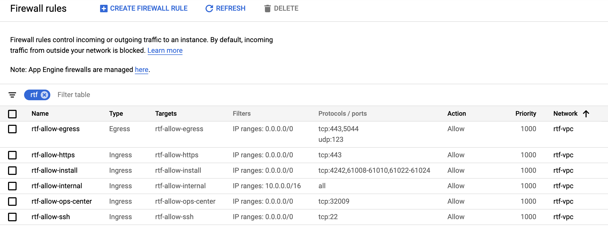
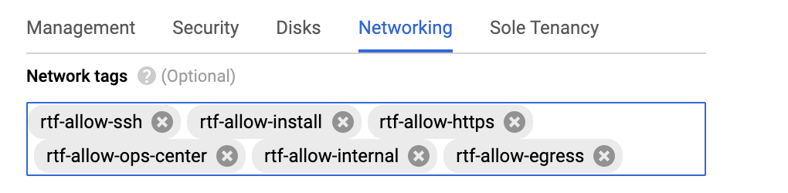
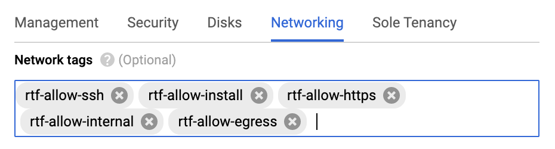
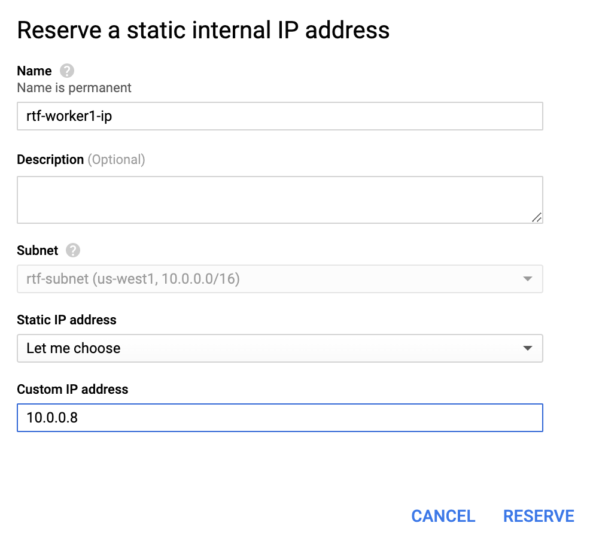

  
Update: May 22, 2020

## Introduction

This workshop will walk you through the process of installing **Anypoint Runtime Fabric (RTF)** on **Google Cloud Platform (GCP)**.

***To log issues***, click here to go to the [github](https://github.com/mulesoft-consulting/RTFonGCP/issues) repository issue submission form.

## Objectives

- **[Create Infrastructure to support Anypoint Runtime Fabric (RTF)](#iaas)**
    - [**STEP 1**: Create Google VPC](#step1)
    - [**STEP 2**: Create Firewall Rules](#step2)
    - [**STEP 3**: Create Controller VM](#step3)
    - [**STEP 4**: Create Worker VMs](#step4)
- **[Install Anypoint Runtime Fabric (RTF)](#installrtf)**
    - [**STEP 5**: Create a Runtime Fabric using Runtime Manager](#step5)
    - [**STEP 6**: Download Install scripts](#step6)
    - [**STEP 7**: Setup and Configure Environment](#step7)
    - [**STEP 8**: Setup and Generate Environment Configuration](#step8)
    - [**STEP 9**: Install RTF](#step9)
- **[Deploy Test Application](#deployapp)**
    - [**STEP 10**: Associate Environments](#step10)
    - [**STEP 11**: Create Certificate-Key pair](#step11)
    - [**STEP 12**: Create a Secret Group in Anypoint Secret Manager](#step12)
    - [**STEP 13**: Create a TLS Context in Anypoint Secret Manager](#step13)
    - [**STEP 14**: Enable Inbound Traffic](#step14)
    - [**STEP 15**: Deploy Application](#step15)
- **[Enable OpsCenter](#opscenter)**
    - [**STEP 16**: Retrieve OpsCenter URL and Credentials](#step16)
    - [**STEP 17**: View Kubernetes Details](#step17)


## Required Artifacts

- The following lab requires a Google Cloud Platform account.

<a id="iaas"></a>
## Create Infrastructure to support Anypoint Runtime Fabric (RTF)

**NOTE:** If using a shared GCP project please add your initials at the end of each name. 

<a id="step1"></a>
### **STEP 1**: Create Google VPC

- From any browser, go to the URL to access Google Cloud Console:

   <https://console.cloud.google.com/>

- Click on the upper left navigation bar. Select **VPC networks**

    

- Click **CREATE VPC NETWORK**

- Enter the following information:

    **Name:** `rtf-vpc` or unique name

    **Subnet Name:** `rtf-subnet` or unique name

    **Region:** `select Region of choice`

    **IP address range:** `10.0.0.0/16`

    

- Click **Create**. Wait for network to be created.

    

<a id="step2"></a>
### **STEP 2**: Create Firewall Rules

Next we need to create **Firewall Rules** to open needed ports for installation of RTF and access to Virtual Machines (VM)

- Under the **VPC Network** menu click **Firewall Rules**. At the top of the page click **CREATE FIREWALL RULE**

- Enter the following information:

    **Name:** `rtf-allow-ssh` or unique name

    **Network:** `select network created in previous step`

    **Target Tags:** `rtf-allow-ssh`

    **Source IP ranges:** `0.0.0.0/0`

    **Protocols and Ports:** `tcp:22`

    

- Click **Create**

    

Repeat the previous steps to create the addition 5 Firewall rules:

- Firewall Rule **rtf-allow-install**:

    **Name:** `rtf-allow-install` or unique name

    **Network:** `select network created in previous step`

    **Target Tags:** `rtf-allow-install`

    **Source IP ranges:** `0.0.0.0/0`

    **Protocols and Ports:** `tcp:4242, 61008-61010, 61022-61024`

- Firewall Rule **rtf-allow-https**:

    **Name:** `rtf-allow-https` or unique name

    **Network:** `select network created in previous step`

    **Target Tags:** `rtf-allow-https`

    **Source IP ranges:** `0.0.0.0/0`

    **Protocols and Ports:** `tcp:443`

- Firewall Rule **rtf-allow-ops-center**:

    **Name:** `rtf-allow-ops-center` or unique name

    **Network:** `select network created in previous step`

    **Target Tags:** `rtf-allow-ops-center`

    **Source IP ranges:** `0.0.0.0/0`

    **Protocols and Ports:** `tcp:32009`

- Firewall Rule **rtf-allow-internal**:

    **Name:** `rtf-allow-internal` or unique name

    **Network:** `select network created in previous step`

    **Target Tags:** `rtf-allow-internal`

    **Source IP ranges:** `10.0.0.0/16`

    **Protocols and Ports:** `All`

- Firewall Rule **rtf-allow-egress**:

    **Name:** `rtf-allow-egress` or unique name

    **Network:** `select network created in previous step`

    **Direction of traffic:** `egress`

    **Target Tags:** `rtf-allow-egress`

    **Destination IP ranges:** `0.0.0.0/0`

    **Protocols and Ports:** `udp:123 tcp:443, 5044`



<a id="step3"></a>
### **STEP 3**: Create Controller VM

Now that we have our network defined we will create the VM's that will host our RTF installation. We will be creating a [Development Configuration](https://docs.mulesoft.com/runtime-fabric/1.4/architecture#development-configuration) which consists of 1 controller vm and 2 worker vm's.

- Click on the upper left navigation bar. Select **Compute Engine -> VM instances**

    

- Click **CREATE INSTANCE**

    **Name:** `rtf-controller` or unique name

    **Region:** `select same region as subnet created`

    **Machine Type:** `Custom`

    **Cores:** `2 vCPU` **Memory:** `8 GB`

    

- Click **Change** on **Boot disk**

- Select **Operating system** to **Red Hat Enterprise Linux**

- Select **Version** to **Ref Hat Enterprise Linux 7**

- Change **Boot disk Size** to **80**

- Click **Select**

    

- Scroll down and expand **Management, security, disks, networking, sole tenancy**

- Select **Disks** and click **Add New Disk**

- Enter the following and click **Done**

    **Name:** `rtf-controller-etcd` or unique name
    
    **Type:** `SSD persistend disk`

    **Deletion rule:** `Delete disk`

    

- Add a 2nd disk. Enter the following and click **Done**

    **Name:** `rtf-controller-docker` or unique name
    
    **Type:** `SSD persistend disk`

    **Deletion rule:** `Delete disk`

    

- Click **Networking** and add the following **Network Tags:**

```
    rtf-allow-ssh
    
    rtf-allow-install
    
    rtf-allow-https
    
    rtf-allow-ops-center
    
    rtf-allow-internal
    
    rtf-allow-egress
```



- Click **Network Interface**

- Change **Network** to **VPC** created in previous step.

- Change **Primary internal IP** to **Reserve static internal IP**

- In pop-up enter the following:

    **Name:** `rtf-controller-ip` or unique name

    **Static IP Address:** `Let me choose`

    **Custom IP address:** `10.0.0.5`

- Click **RESERVE**

    

    

- Click **Create**

    

<a id="step4"></a>
### **STEP 4**: Create Worker VMs

Now we will create 2 worker VMs following the same steps as the controller vm will some small changes.

- Click **CREATE INSTANCE**

    **Name:** `rtf-worker1` or unique name

    **Region:** `select same region as subnet created`

    **Zone:** `choose a different zone from controller vm`

    **Machine Type:** `Custom`

    **Cores:** `2 vCPU` **Memory:** `15 GB`

    **Extended Memory:** `check box`

    

- Click **Change** on **Boot disk**

- Select **Operating system** to **Red Hat Enterprise Linux**

- Select **Version** to **Ref Hat Enterprise Linux 7**

- Change **Boot disk Size** to **80**

- Click **Select**

    

- Expand **Management, security, disks, networking, sole tenancy**

- Select **Disks** and click **Add New Disk**

- Enter the following and click **Done**

    **Name:** `rtf-worker1-docker` or unique name
    
    **Type:** `SSD persistend disk`

    **Deletion rule:** `Delete disk`

    

- Click **Networking** and add the following **Network Tags:** 

```
    rtf-allow-ssh
    
    rtf-allow-install
    
    rtf-allow-https
    
    rtf-allow-internal
    
    rtf-allow-egress
```



- Click **Network Interface**

- Change **Network** to **VPC** created in previous step.

- Change **Primary internal IP** to **Reserve static internal IP**

- In pop-up enter the following:

    **Name:** `rtf-worker1-ip` or unique name

    **Static IP Address:** `Let me choose`

    **Custom IP address:** `10.0.0.8`

- Click **RESERVE**

    

    

- Click **Create**

- Repeat these stesp to create a 2nd worker vm **name** `rtf-worker2` with **reserved ip** of `10.0.0.9`

    

<a id="installrtf"></a>
## Install Anypoint Runtime Fabric (RTF)

In this section will will walk through installing RTF. For complete instructions please visit [MuleSoft Docs](https://docs.mulesoft.com/runtime-fabric/1.4/)

<a id="step5"></a>
### **STEP 5**: Create a Runtime Fabric using Runtime Manager

- From any browser, go to the URL to access **Anypoint Platform**

    <https://anypoint.mulesoft.com>

- Click on the upper left navigation bar. Select **Runtime Manager**

    

- Click **Runtime Fabrics**

- Click **Create Runtime Fabric**

    **Name:** `rtf_on_gcp` or unique name

- Click **Create**

    

- Later will we come back to this page for the **activation code**

<a id="step6"></a>
### **STEP 6**: Download Install scripts

The following steps should be executed on all 3 VMs. Steps below will be for just controller vm.

- Go back to **Google Cloud Platform**. If not on the **VM instances** page navigate back to **VM instances** page.

- Click **SSH** and select **Open in browser window**

    

- From the SSH session execute the following commands:

- Install **curl**

```bash
sudo yum install zip unzip -y
```


- Download and Extract install sceripts

```bash
curl -L https://anypoint.mulesoft.com/runtimefabric/api/download/scripts/latest --output rtf-install-scripts.zip
mkdir -p ./rtf-install-scripts && unzip rtf-install-scripts.zip -d ./rtf-install-scripts
```


- repeat these steps on the other 2 VM's

<a id="step7"></a>
### **STEP 7**: Setup and Configure Environment

The following steps should be executed on all 3 VMs. Steps below will be for just controller vm.

- Create runtime directory

```bash
sudo mkdir -p /opt/anypoint/runtimefabric
```

- Change ownership of **runtimefabric** directory to current user

```bash
sudo chown <your username>:<your username> /opt/anypoint/runtimefabric
```

- Copy install script to runtime directory

```bash
cd
cp ./rtf-install-scripts/scripts/init.sh /opt/anypoint/runtimefabric/init.sh && chmod +x /opt/anypoint/runtimefabric/init.sh
```


<a id="step8"></a>
### **STEP 8**: Setup and Generate Environment Configuration

- On the controller vm change into the install script directory for manual install

```bash
 cd rtf-install-scripts/manual/
 ```

 - Next run the generate config script. You will need the **activation code** from the previous step and will also need a valid MuleSoft license. To generate a **Base64** license follow [MuleSoft Docs](https://docs.mulesoft.com/runtime-fabric/1.4/install-manual#base64-encode-your-mule-license-key)

 ```bash
RTF_CONTROLLER_IPS='10.0.0.5' \
RTF_WORKER_IPS='10.0.0.8 10.0.0.9' \
RTF_DOCKER_DEVICE='/dev/sdb' \
RTF_ETCD_DEVICE='/dev/sdc' \
RTF_ACTIVATION_DATA='<activation code>' \
RTF_MULE_LICENSE='<Base64 MuleSoft License>' \
./generate-configs.sh
 ```


- From the output of the **generate-config.sh** execute the **cat** command to create the **env** file for each VM.

<a id="step9"></a>
### **STEP 9**: Install RTF

- Run the **init.sh** script in privileged mode on the controller VM.

```bash
sudo /opt/anypoint/runtimefabric/init.sh
```

- Wait for install to complete on controller vm before moving forward


- Run the **init.sh** script in privileged mode on both of the worker VM.

```bash
sudo /opt/anypoint/runtimefabric/init.sh
```


- If you go back to **Anypoint Platform** and go to **Runtime Fabrics** you should see that your RTF environment is now **Active**

    

 <a id="deployapp"></a>
## Deploy Test Application

Now that we have a running installation of Anypoint Runtime Fabric lets test that we can deploy an application to RTF.

<a id="step10"></a>
### **STEP 10**: Associate Environments

- If not already on the page, navigate back to your newly created **Runtime Fabric** in **Anypoint Platform**

- Click on **Associate Environments**

- Select the environment you would like to associate with this instance of RTF. In this example we have selected **Sandbox**. Click **Apply Allocations**

    

<a id="step11"></a>
### **STEP 11**: Create Certificate-Key pair

In this step we will create a new certificate to but used by RTF. If you do not have **openssl** installed on your laptop you will need to install before moving forward.

- Open a terminal window and execute the following command

```bash
openssl req -x509 -newkey rsa:4096 -keyout key.pem -out cert.pem -days 365
```

- For the prompts we will use the following change as needed:

    **PEM pass phrase:** `mulesoft`

    **Country:** `US`

    **State or Province:** `CA`

    **Locality Name:** `San Francisco`

    **Organization Name:** `Mulesoft`

    **Organizational Unit Name:** `<leave blank>`

    **Common name:** `*.domain.com`

    **Email Address:** `<leave blank>`


<a id="step12"></a>
### **STEP 12**: Create a Secret Group in Anypoint Secret Manager

- Back in the browser, navigate to **Secrets Manager** and click **Create Secret Group**

- Enter a name **rtf-group** and click **Save**

    

- In the left sidebar, select **Keystore**

- Click **Add Keystore**

- Enter the following information:

    **Name:** `rtf-keystore`

    **Type:** `PEM`

    **Certificate File:** `<select cert.pem created in previous step>`

    **Key File:** `<select key.pem created in previous step>`

    **Key Passphrase:** `mulesoft`

    

- Click **Save**

<a id="step13"></a>
### **STEP 13**: Create a TLS Context in Anypoint Secret Manager

- In the left sidebase, select **TLS Context**

- Click **Add TLS Context**

- Enter the following information:

    **Name:** `rtf-tls`

    **TLS Version:** `TLS 1.2`

    **Target:** `Anypoint Security`

    **Keystore:** `rtf-keystore`

    

- Click **Save**

- Click the back button **SECRET GROUPS**

    

- Click **Finish**

    

<a id="step14"></a>
### **STEP 14**: Enable Inbound Traffic

- Navigate back to your **Runtime Fabric**. Select tab **Inbound Traffic**

- Toggle **Enable inbound traffic**

    

- Scroll down to **Resource Allocation** and select **1 vCPU**

- Set the following based on previous steps:

    **Environment:** `Sandbox`

    **Secret Group:** `rtf-group`

    **TLS Context:** `rtf-tls`

    

- Click **Deploy**

<a id="step15"></a>
### **STEP 15**: Deploy Application

Now we are ready to deploy an application. In this example we will use a sample application that is in the github repository. To use this application you will need to clone the repository so that you can access the file from your local files system.

- Use the following command to clone the github repository:

```bash
git clone https://github.com/mulesoft-consulting/RTFonGCP.git
```


- In Anypoint Platform, navigate to **Runtime Manager** and click **Applications**

- Click **Deploy Application**

- Enter the following information:

    **Application Name:** `rtfdemo`

    **Deployment Target:** `rtf_on_gcp`

    **Application File:** `<upload rtf-demo-1.0.zip from local file system>`

    **Runtime Version:** `3.9.4`

    

- Click **Deploy Application**

- Wait for application to deploy then click on application to view deployment details.

    

- As you can see the **Application url** is based on the certificate entry that we created in a previous step. To be able to access this we would need to create a DNS entry. To keep things simple we will just update our local host file to have the **public ip** for the **controller vm** point to the application hostname.

- Add the following line to your local **hosts** file.

```bash
# RTF On GCP Cookbook Sample Application
<Eternal IP Controller VM>  rtfdemo.domain.com
```

- Now access the following URL:

    <https://rtfdemo.domain.com/welcome>

    


<a id="opscenter"></a>
## Enable OpsCenter

In this section, you enable OpsCenter, the main graphical management tool for Kubernetes clusters. OpsCenter is part of the TeleKube distribution, but not publicly accessible by default after a Runtime Fabric installation. 

Now that we have a running installation of Anypoint Runtime Fabric lets test that we can deploy an application to RTF.

<a id="step16"></a>
### **STEP 16**: Retrieve OpsCenter URL and Credentials

- From the Control VM SSH session execute the following command to locate credentials and URL for administrator access:

```bash
cat /var/log/rtf-init.log | grep -B 1 -A 3 "Ops Center access"
```


- Replace private IP **10.0.0.5** with public IP for controller VM.

- Open browser and enter URL you just retrieved.

- Since we are using self signed certificates you will need to confirm access to the URL. Click **Proceed to IP (unsafe)**

    

- On login page use username and password from the output of the command above and click **Login**

    

- You should see a landing page

    

<a id="step17"></a>
### **STEP 17**: View Kubernetes Details

- Let view details for the Pods running the deployed demo application. On the left hand side, click Kubernetes then click Pods. On the right hand side click drop down and select namespace that consists of a long sequence of numbers and characters.

    

- On this screen you can see details around the deployment of the application.

    

- **CONGRATULATIONS!!!** You have completed installing Anypoint Runtime Fabric on Google Cloud Platform
